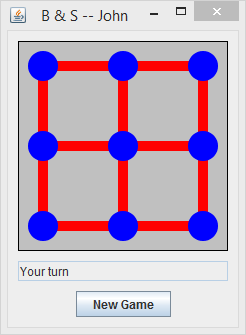
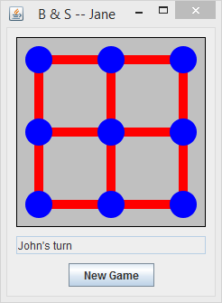
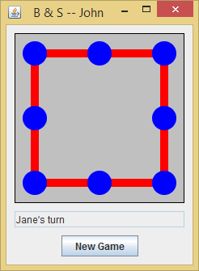
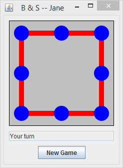
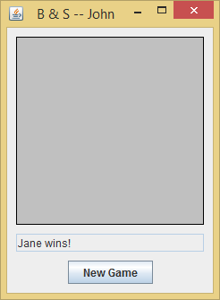
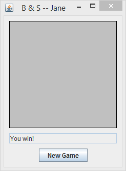

# BallAndStickGame

A java program written for Parallel and Distributed Systems. It uses the TCP and a client-server model to play a game with multiple players. The game is called Ball and Stick. Players take turns removing either a ball or a stick, removing a ball removes all adjacent sticks. The player that removes the last piece, a ball or a stick, loses.

## Usage

Navigate to the src folder and compile the server program with:

	javac BnsServer.java

and the client program with:

	javac Bns.java
	
Then run the server program with:

	java BnsServer <host> <port>
	
where host and port are the host and port number, you can use localhost as host
and 5678 as port.

Open another command prompt and run a client program with:

	java Bns <host> <port> <name>
	
where host and port are the same as above and name is the player's name.

BnsServer must be run first to establish a server for players to play on and
it must be left running until the players are done. Each game requires two
players so Bns must be run twice to start a game (a game window will 
still appear for one player but they will not be able to play). The players
do not need to have unique names.

## Example Game

### John starts a game and waits for another player

### Jane joins the game
 

### John makes the first move
 

### After a few more moves Jane wins
 
